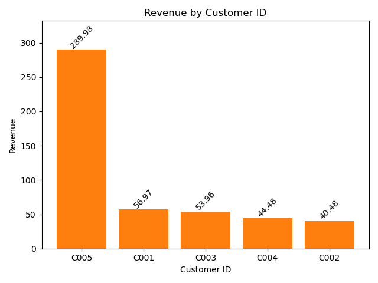

📊 Retail Sales Analytics — Python Project
End-to-End Retail Insights Using Pandas, Matplotlib & Exploratory Data Analysis (EDA)

This project demonstrates a complete real-world retail analytics workflow using Python.
You take raw sales data → clean it → engineer features → perform EDA → extract business insights → visualise → summarise.

This is a portfolio-ready project showcasing skills required for Data Analyst roles.

🚀 Project Objectives

* Analyse retail sales across products, customers, weekdays, months, and countries
* Identify top-performing categories, products, and customers
* Understand customer purchasing frequency
* Build actionable business insights
* Communicate results using charts and summary files

 🗂️ Project Structure
Retail_Sales_Analytics_Python/
 │
 ├── 01_Data/
 │   ├── 01_Raw/                 # Original input dataset (Excel/CSV)
 │   └── 02_Processed/           # Cleaned dataset exported from Python
 │
 ├── 02_Notebooks/
 │   └── retail_sales_analysis.ipynb   # Full Jupyter Notebook with analysis
 │
 ├── 03_Src/
 │   └── README.md
 │
 ├── 04_Outputs/
 │   ├── 01_Charts/              # All visualisations (PNG)
 │   └── 02_Summary/             # Summary CSVs for further review
 │
 ├── exec_summary.md             # Written executive summary
 └── README.md                   

 🧹 Data Cleaning & Preparation

Processed using Pandas:

✔️ Converted dates → datetime
 ✔️ Extracted year, month, day, weekday
 ✔️ Added revenue = quantity * unit_price
 ✔️ Removed errors, fixed dtypes
 ✔️ Created processed dataset for downstream analysis

 📈 Key Analysis Performed
  1️⃣ Revenue by Product Category

* Identified high-level performance across major product categories.
* Furniture and Electronics were strongest performers.

2️⃣ Revenue by Month

* Shows seasonal / monthly performance.
(Current dataset contains only January)

3️⃣ Revenue by Weekday

* Analysed daily performance patterns.
* Wednesday showed the highest revenue.

4️⃣ Revenue by Country

* Compared international sales performance.
* United Kingdom showed strongest sales activity.

5️⃣ Top 5 Products by Revenue

* Ranked individual product performance:
* Standing Desk, Office Chair, and Wireless Mouse were top sellers.

6️⃣ Top 6 Customers by Purchase Frequency

* Analysed customer lifetime engagement using value_counts().

 📊 Visualisations

All charts exported as PNG into:

 

 Includes:

* revenue_by_category

* revenue_by_country

* revenue_by_month

* revenue_by_product

* revenue_by_top5_product

* revenue_by_weekday

* customer_top6_purchase_freq

* Each chart includes:

✔️ labelled x/y axes
✔️ data labels
✔️ rotated text for readability
✔️ clean formatting for professional presentation

 📄 Summary Files

All summary tables exported as .csv into:

 Includes:

* revenue_by_category.csv

* revenue_by_country.csv

* revenue_by_month.csv

* revenue_by_weekday.csv

* revenue_by_product.csv

* revenue_by_top5_product.csv

* customer_top6_purchase_freq.csv

* retail_sales_processed.csv (full cleaned dataset)

 🧠 Executive Summary

A separate exec_summary.md file outlines:

* topline findings

* sales trends

* customer behaviour patterns

* recommended actions for the business

* This simulates real-world stakeholder reporting.

🛠️ Technologies Used
Tool / Library	Purpose
Python	Core data manipulation
Pandas	Cleaning, grouping, aggregations
Matplotlib	Visualisation
Jupyter Notebook	Analysis environment
Excel/CSV	Dataset & exports

 📦 How to Run This Project

Clone the repo:

git clone https://github.com/yourusername/Retail_Sales_Analytics_Python.git

Install libraries:

pip install pandas matplotlib notebook

Open Jupyter Notebook:

jupyter notebook

Run:

 🧩 Future Improvements

* Add time series forecasting (Prophet, ARIMA)

* Integrate Power BI for dashboards

* Add customer segmentation (K-means clustering)

* Build dynamic Python scripts in /03_Src/

 ⭐ Key Takeaways

This project demonstrates:

✔️ End-to-end data analysis workflow
✔️ Clean modular folder structure
✔️ Visual storytelling
✔️ Business-ready insights
✔️ Strong analytical thinking

  👤 About the Developer

Schikan (Portfolio Project)
 Aspiring Data Analyst | BI Analyst
 Focused on Power BI, SQL, Azure, and real-world practical analytics.

## 📬 Contact
📧 Email: **schikan@yahoo.co.uk**  
🔗 GitHub: **https://github.com/shikzta**

 📄 License

This project is open for educational and portfolio use.

